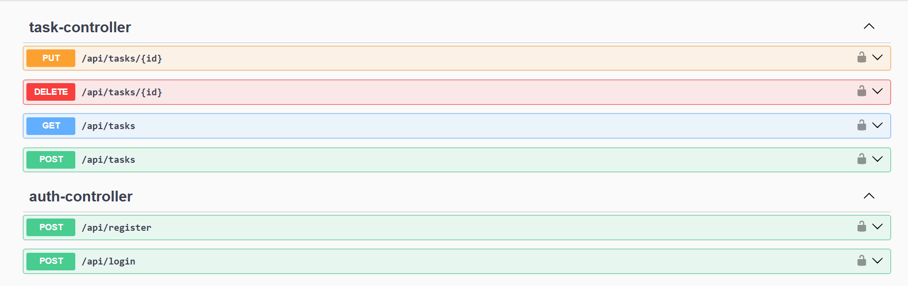
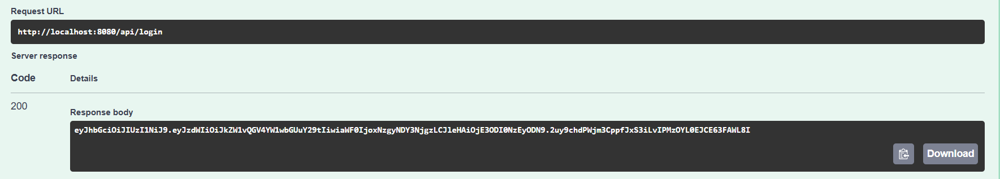
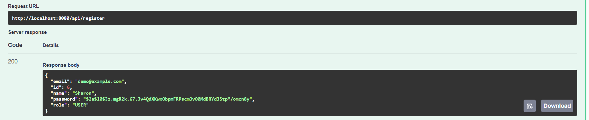
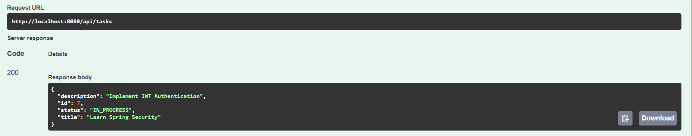
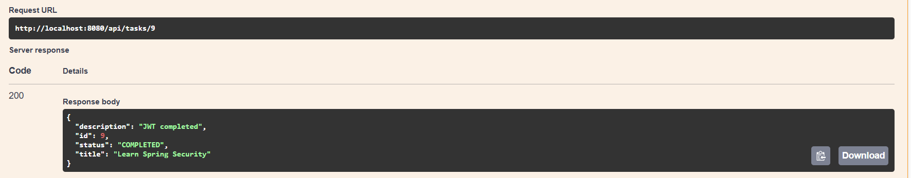

# Task Manager API

A Spring Boot REST API for managing tasks with JWT Authentication and MySQL.

## Features

- User Registration
- User Login
- JWT Authentication
- Create Tasks
- View Tasks
- Update Tasks
- Delete Tasks
- Task Status Management
- Validation
- Global Exception Handling
- Swagger Documentation

## Tech Stack
- Java 21
- Spring Boot
- Spring Security
- JWT
- Hibernate/JPA
- MySQL
- Gradle
- Swagger/OpenAPI

## API Endpoints
### Authentication
POST/api/register

POST/api/login

### Tasks
GET/api/tasks

POST/api/tasks

PUT/api/tasks/{id}

### Security
Protected APIs require JWT Authentication.

### Author
Sharon Dhammu

## Screenshots

### Swagger UI

### Login Success

### Create Task

### Get Tasks

### Update Task

